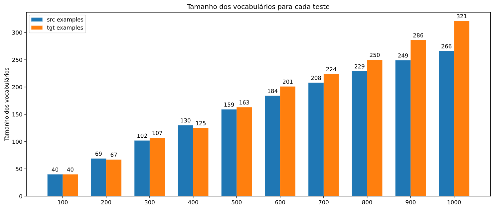

# Perguntas

## Pergunta 1
**Tente valores diferentes do argumento num_examples na função load_data_nmt. Como isso afeta os tamanhos do vocabulário do idioma de origem e do idioma de destino?**



Como podemos ver no gráfico acima, onde o eixo x representa o argumento num_examples da função indicada variando de 100 a 1000 e as colunas indicam o tamanho do vocabulário tanto de origem quanto de destino, podemos concluir que quanto maior o tamanho do teste maior o tamanho dos vocabulário, principalmente a partir dos testes acima de 500.

## Pergunta 2
**O texto em alguns idiomas, como chinês e japonês, não tem indicadores de limite de palavras (por exemplo, espaço). A tokenização em nível de palavra ainda é uma boa ideia para esses casos? Por que ou por que não?**

```
def tokenize_nmt(text, num_examples=None):
    source, target = [], []
    for i, line in enumerate(text.split('\n')):
        if num_examples and i > num_examples:
            break
        parts = line.split('\t')
        if len(parts) == 2:
            source.append(parts[0].split(' '))
            target.append(parts[1].split(' '))
    return source, target
```
Como podemos ver no código da função acima, a tokenização é feita por meio do split indicado pelo espaço. Em idiomas como o chinês e o japonês que o espaço não indica uma separação entre as palavras, a tokenização não seria feita de forma correta, portanto a forma com que estamos fazendo não seria indicada para esses casos, pois não traria uma boa eficiência. Para casos como esses, poderiamos melhorar a eficiência do modelo alterando o parâmetro da função split para algum delimitador de caractere ou palavra, permitindo com que assim o modelo saiba lidar com a estrutura linguística desses idiomas de forma correta.